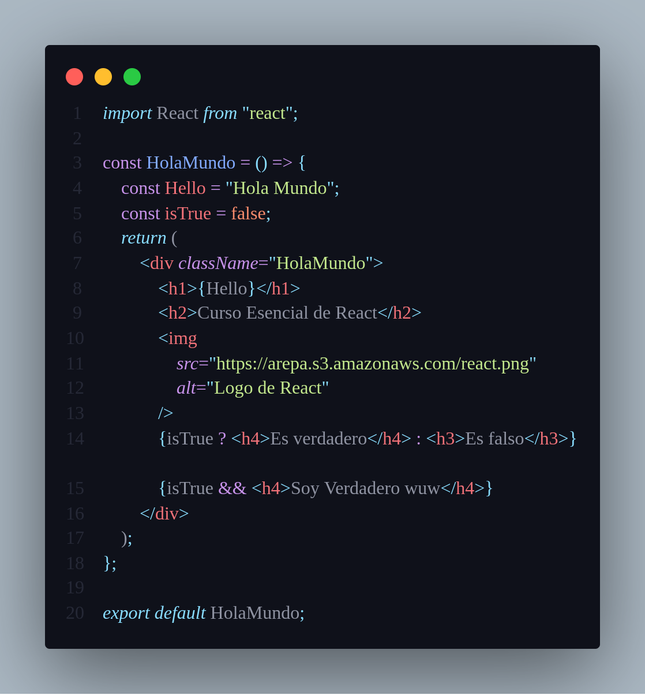

# CURSO PRACTICO DE REACT JS

## ¿Qué es React JS?

React es una librería o mejor conocida como biblioteca de JS para construir interfaces de usuario, esta es su única finalidad, por este motivo es muy amada por la comunidad de frontend developers. React está basado en componentes, esto nos permite separar cada uno de los elementos de nuestra página web en pequeños pedazos llamados componentes y después proceder a conectarlos para crear sorprendentes apps.

React se puede utilizar en la web, también se pueden crear aplicaciones para Windows, MAC o Linux, además de crear aplicaciones moviles utilizando React Native. 


### ¿Dónde nace React?

Remontando al año 2013 dentro de Facebook, ahí nace React. React nace como una necesidad para solventar una pequeña particularidad que era Timeline hasta llegar al punto que hoy podemos observar en dicha red social. Además de esto, se empezó a implementar React en Instagram y cuando se dieron cuenta que habían creado un buen producto se liberó a la comunidad y así es cómo ha llegado a los desarrolladores. Es importante aclarar que Facebook está detrás de React, actualizandolo y añadiendo nuevas funcionalidades \(los Hooks siendo la más destacable\), esto genera confianza entre la comunidad de desarrolladores para trabajar con esta librería y a los nuevos developers para aprender a usarla. 


## DOM, Virtual DOM y React DOM

### ¿Qué es el virtual DOM?

Es una herrmaienta que implementa React para darle performance y velocidad a nuestros desarrollos, esto significa que tenemos una copia fiel del **REAL DOM.** 

Tenemos una aplicación hecha con React la cuál tiene una serie de elementos que debemos llenar, en nuestro caso será nuestro perfil, imaginemos que debemos llenar cada uno de estos y por cada uno de los elementos que vamos a actualizar nuestro **DOM** se debía refrescar totalmente \(así es como actualmente el trabaja el **DOM**\), ****pero con React y el virtual DOM ahora tenemos esta copia del **DOM** que nos permite identificar cada uno de estos elementos y saber cuál ha sido el que se actualizó. 

Ya que “DOM virtual” es más un patrón que una tecnología específica, las personas a veces le dan significados diferentes. En el mundo de React, el término “DOM virtual” es normalmente asociado con [elementos de React](https://es.reactjs.org/docs/rendering-elements.html) ya que son objetos representando la interfaz de usuario. Sin embargo, React también usa objetos internos llamados “fibers” para mantener información adicional acerca del árbol de componentes. Éstos pueden ser también considerados como parte de la implementación de “DOM virtual” de React. 

#### ¿Es el Shadow DOM lo mismo que el DOM virtual? <a id="es-el-shadow-dom-lo-mismo-que-el-dom-virtual"></a>

No, son diferentes. El Shadow DOM es una tecnología de los navegadores diseñada principalmente para limitar el alcance de variables y CSS en componentes web. El DOM virtual es un concepto que implementan bibliotecas en JavaScript por encima de las APIs de los navegadores.

## Create React APP y Tipos de Componentes

### Create React App

**Create React App** is an officially supported way to create single-page React applications. It offers a modern build setup with no configuration.

En español y en palabras un poco más coloquiales, **Create React App** es un comando el cuál nos genera el mejor entorno de desarrollo posible para crear una aplicación con React, utilizando las últimas actualizaciones de JavaScript y trayendo consigo una configuración que facilita el desarrollo de nuestras apps. Para crear un proyecto se ejecuta: 

```text
npx create-react-app my-app
cd my-app
npm start
```

> Note:
>
> Cabe aclarar que para esto es necesario tener instalado node, dado que npx es una herramienta de ejecución de paquetes compatible con NodeJS a partir de su versión 5.2

Como sabemos de antemano, **Create React App** nos crea una configuración para trabajar con React en el frontend, dicha configuración no involucra el _backend_ en ningún momento, por lo cuál es posible trabajar con cualquier tecnología backend \(NodeJS, PHP, Django, Ruby, etc\). 

Finalmente, como en la mayoría de tecnologías, la mejor fuente de información es la documentación. Además, la documentación de Create React App es muy amigable y te ayudará en la mayoría de dudas que tengas. Para digirte a ella puedes hacer click [aquí](https://create-react-app.dev/docs/getting-started).

Ahora, al ejecutar el comando **Create React App** nuestro directorio en VS Code se verá de la siguiente forma: 


En estos momentos solo nos va a interesar la carpeta src \(sources\), en dicha carpeta vamos a crear una nueva carpeta llamanda **components** y en esa vamos  a crear nuestros componentes. 

### Componentes con estado y sin estado

Una característica de los componentes, es su estado, el cual determina tanto la información que se muestras en pantalla, hasta como se representa la información, de esta forma, el estado puede cambiar la apariencia gráfica de un componente y la forma en que se muestra la información. Un ejemplo básico de un estado, es, por ejemplo, un formulario que puede pasar de modo lectura a escritura.

### Component Stateul

Este componente es particularmente conocido como la estructura de clase, nos va a permitir tener ciclo de vida y estado, además de esto es el componente más robusto que tiene React. 

Para construirlo, primeramente identficamos nuestra carpeta de **components,** nos ubicamos allí y dentro de ella creamos un documento `Stateful.js.`

> Nota:
>
> Los componentes en React empiezan con mayúscula, es una convención adoptada por la comunidad dado que los componentes que empiezan con minúscula serían interpretados por React como elementos del DOM.


Como es posible observar, Stateful es un **componente con estado**, este componente tiene un estado asociado el cual se manipula a medida que el usuario interactúa con la aplicación. 

Para entender un poco mejor que es lo que significa cada uno de las líneas que conforman este componente, recomiendo ir a la documentación, a la cuál puedes acceder [aquí](https://es.reactjs.org/docs/state-and-lifecycle.html)

### Component Stateless

Este es un componente más sencillo que el anterior. Para crearlo, empezaremos importando React, y seguimos con la creación de nuestra arrow function que retorna directamente el elemento HTML que necesitamos. Una vez tenemos dichos elementos, exportamos nuestro componente. 


Este tipo de componentes son los más simples, pues solo se utilizan para representar la información que les llega como parámetros. En algunas ocasiones, estos componentes pueden transformar la información con el único objetivo de mostrarla en un formato más amigable, sin embargo, estos compontes no consumen datos de fuentes externas ni modifican la información que se les envía.

## JSX: JavaScript +HTML

### [¿Qué es JSX?](https://es.reactjs.org/docs/introducing-jsx.html)

JSX es una extensión de sintaxis de JavaScript que nos permite mezclar JS y HTML \(XML\), de ahí su nombre JavaScript XML.

Esta extensión nos facilita la vida pues nos permite escribir un código más limpio, sin tantas repeticiones \(DRY\), y con muy pocos factores o condiciones a tener en cuenta.

### ¿Por qué JSX?

React acepta el hecho de que la lógica de renderizado está intrínsecamente unida a la lógica de la interfaz de usuario: cómo se manejan los eventos, cómo cambia el estado con el tiempo y cómo se preparan los datos para su visualización.

En lugar de separar artificialmente _tecnologías_ poniendo el maquetado y la lógica en archivos separados, React separa _intereses_ con unidades ligeramente acopladas llamadas “componentes” que contienen ambas. Volveremos a los componentes en [otra sección](https://es.reactjs.org/docs/components-and-props.html), pero si aún no te sientes cómodo maquetando en JS, [esta charla](https://www.youtube.com/watch?v=x7cQ3mrcKaY) podría convencerte de lo contrario.

React [no requiere](https://es.reactjs.org/docs/react-without-jsx.html) usar JSX, pero la mayoría de la gente lo encuentra útil como ayuda visual cuando trabajan con interfaz de usuario dentro del código Javascript. Esto también permite que React muestre mensajes de error o advertencia más útiles.

### Primer acercamiento a JSX

A la hora de crear nuestros componentes, estos pueden llevar la extensión .JS y funcionar completamente, pero es igual de viable crearlos con la extensión .JSX. En el último caso, nuestro editor de código detectará que estamos trabajando con archivos de JavaScript, pero en particular con archivos de React.

> Nota:
>
> React utiliza clases, vamos a trabajar con clases dentro de nuestro proyecto. Es importante saber que class es una palabra reservada dentro de JavaScript, por lo cuál utilizaremos className en lugar de class.



JSX presenta una sintáxis un tanto peculiar. Como podemos observar, este componente **no tiene estado**. Además, vemos que es posible con el uso de `{}` utilizar herramientas propias de JavaScript, tal como llamar una variable o incluso manejar condicionales para decidir si mostrar o no un elemento en el HTML. 

Ahora nos interesa conectar nuestro componente a nuestra aplicación y verlo en en browser. Para esto, buscaremos un archivo llamando `index.js` en el cuál se encuentra toda la configuración de nuestro proyecto. En dicho documento vamos a importar nuestro componente, por defecto dentro de las etiquetas de **React.StrictMode** estará el componente _App_, así que cambiaremos este por nuestro componente _HolaMundo_.


Y finalmente, así debería verse nuestro componente en el navegador:


Finalmente, para complementar la información de JSX, se deja el link para acceder a la [documentación oficial](https://es.reactjs.org/docs/introducing-jsx.html) :\) .

## ¿Qué son los métodos del ciclo vida?

Todos los componentes en React pasan por una serie de fases que generalmente se denominan “Ciclo de Vida del componente” es un proceso que React hace en cada componente, en algunos casos no podemos verlos como un bloque de código y en otros podemos llamarlos en nuestro componente para asignar una actividad según sea el caso necesario.

Los componentes en react pasan por un Montaje, Actualización, Desmontaje y Manejo de errores.

### Montaje:

En esta fase nuestro componente se crea junto a la lógica y los componentes internos y luego es insertado en el DOM.

### Actualización:

En esta fase nuestro componente está al pendiente de cambios que pueden venir a través de un cambio en “state” o “props” esto en consecuencia realizan una acción dentro de un componente.

### Desmontaje:

En esta etapa nuestro componente “Muere” cuando nosotros no necesitamos un elemento de nuestra aplicación, podemos pasar por este ciclo de vida y de esta forma eliminar el componente de la representación que tiene en el DOM.

### Manejo de Errores:

Cuando nuestro código se ejecuta y tiene un error, podemos entrar en una fase donde se puede entender mejor qué está sucediendo con la aplicación.

Algo que debemos tener en cuenta es que un componente NO debe pasar por toda las fases, un componente puede ser montado y desmontado sin pasar por la fase de actualización o manejo de errores.

Ahora que entendemos las fases que cumple el ciclo de vida en React vamos a entrar a detalle en cada uno de ellos para ver qué piezas de código se ejecutan y nos ayudarán a crear aplicaciones en React pasando por un ciclo de vida bien estructurado.

### Montado:

**Constructor\(\)**

Este es el primer método al que se hace un llamado, aquí es donde se inicializan los métodos controladores, eventos del estado.

**getDerivedStateFromProps\(\)**

Este método se llama antes de presentarse en el DOM y nos permite actualizar el estado interno en respuesta a un cambio en las propiedades, es considerado un método de cuidado, ya que su implementación puede causar errores sutiles.

**render\(\)**

Si queremos representar elementos en el DOM en este método es donde se escribe esta lógica, usualmente utilizamos JSX para trabajar y presentar nuestra aplicación.

**ComponentDidMount\(\)**

Este método se llama inmediatamente que ha sido montado en el DOM, aquí es donde trabajamos con eventos que permitan interactuar con nuestro componente.

#### Actualización:

getDerivedStateFromProps\(\)

Este método es el primero en ejecutarse en la fase de actualización y funciona de la misma forma que en el montaje.

**shouldComponentUpdate\(\)**

Dentro de este método se puede controlar la fase de actualización, podemos devolver un valor entre verdadero o falso si queremos actualizar o no el componente y es utilizado principalmente para optimización.

**render\(\)**

Se llama el método render que representa los cambios en el DOM.

**componentDidUpdate\(\)**

Este método es invocado inmediatamente después de que el componente se actualiza y recibe como argumentos las propiedades y el estado y es donde podemos manejar nuestro componente.

#### Desmontado

**componentWillUnmount\(\)**

Este método se llama justo antes de que el componente sea destruido o eliminado del DOM.

#### Manejo de Errores:

**getDerivedStateFromError\(\)**

Una vez que se lanza un error este es el primer método que se llama, el cual recibe el error como argumento y cualquier valor devuelto en este método es utilizado para actualizar el estado del componente.

**componentDidCatch\(\)**

Este método es llamado después de lanzarse un error y pasa como argumento el error y la información representada sobre el error.

Ahora que entendemos cada una de las fases que tiene el ciclo de vida de react, podemos utilizarlas según sea necesario en nuestra aplicación y de esta forma crear las interacciones que necesitemos.


## Props: Comunicación entre componentes

Así como las funciones en JS reciben parámetros, nosotros podemos pasar propiedades a nuestros distintos componentes, indiferente si es de tipo clase o solamente presentacional. Estas propiedades son solo de lectura, y en dado caso que deseamos cambiarlas o modificarlas, es necesario instanciarlas en una nueva variable. 

Teniendo en cuenta esto, vamos a hacer un pequeño ejercicio en el cuál quedará más claro como pasamos propiedades a nuestros componentes. Crearemos un nuevo componente llamado Button


Existen dos formas para trabajar con las props:

La primera consiste en mandarle nuestras props desde Index.js, como se muestra a continuación: 


Vemos que en este caso, mandamos el `text="Click"` que vendrian siendo las props para nuestro componente _Button._

\_\_

La otra forma consiste en destructurar los datos, lo cuál significa que extraemos el valor de text de las props. Para que quede esto claro, crearemos otro botón en nuestro componente _Button_

\_\_


Como podemos observar, el segundo botón presenta una sintaxis un tanto más amigable. Sin embargo, para poder realizarlo es necesario tener claro el concepto de desestructuración de objetos. Si no lo tienes claro o quieres reforzar, puedes ir al curso de [fundamentos de JS](https://platzi.com/clases/fundamentos-javascript/).

## State-Events

Ya hemos trabajo lo suficiente con componentes sin estado o presentacionales, es hora de empezar a poner en práctica componentes con estado y empezar a entender el uso de eventos. 

Vamos a modificar nuestro componente _Button,_ convertirlo a **Stateful** , añadirle estado y trabajar con eventos. 


Aquí, ya creamos la **clase** para nuestro componente. Utilizamos la sintaxis vista anteriormente, pero falta algo muy importante: debemos agregarle el estodo, pero....¿qué es el estado?

### ¿Qué es el estado?

El estado es un objeto al cuál le podemos definir variables que pueden ser de tipo string, integers, floats, booleanos o funciones y vamos a poder acceder dentro de nuestro componente en el momento  en el momento en el que se inicializa. Esto nos permitirá tener elementos que vamos a usar. 

Vamos a realizar un contador que iniciará en cero y con cada click que realicemos se debe actualizar el estado del componente


En este punto ya añadimos a nuestro componente un estado. Sin embargo, al acceder a el en nuestro navegador vemos que al oprimir el botón click no ocurre nada, esto es porque no hemos asignado eventos a nuestro componente. Vamos a hacerlo:


En estos momentos, ya nuestro componente posee tanto estado como evento, así que cuando demos click en nuestro botón, este sumará 1 al valor anterior del contador. 

## Instalación y configuración de entorno

A partir de esta sección, seguiremos trabajando en el proyecto de la **Escuela de JavaScript:** _**Platzi Video .**_ ****Por esto, crearemos un nuevo repositorio en el cuál trabajar con nuestra app. 

[https://github.com/AndrewEspejo/PlatziVideo](https://github.com/AndrewEspejo/PlatziVideo)

A continuación, estarán unas pautas para crear nuestro entorno de desarrollo:

```text
git init
npm init -y
```

Antes de instalar React en nuestro proyecto, crearemos las rutas con las cuales trabajaremos en nuestra aplicación. Al finalizar, nuestro proyecto debería estar estructurado de la siguiente forma: 


Ahora si, procedemos a instalar React y ReactDOM en nuestro proyecto

```text
npm install react react-dom
```

Después de realizar esto, se habrán añadido nuevos archivos a nuestro proyecto, además de modificarse el package.json, siendo agregado en este React y React-DOM


## Agregando compatibilidad con todos los navegadores usando Babel

### ¿Qué es babel?

Babel es una herramienta que nos permite a los developers utilizar JavaScript moderno y transpilarlo a JavaScript que pueda ser interpretado por todos los navegadores. Esto es genial porque nos permite trabajar con JavaScript moderno utilizando nuevas utilidades y que los navegadores puedan ser compatibles con dicho código.

### Hello World

Crearemos nuestro primer componente HelloWorld en la carpeta de _components_ 


Ya tenemos listo nuestro componente, sin embargo, necesitamos nuestro punto de entrada que es el primer archivo que será detectado y en el cuál vamos a trabajar con toda la configuración de React. Este archivo es `index.js` .


Con esto realizado, pasamos a darle forma a nuestro documento i`ndex.html`


Ahora si, pasamos a instalar Babel en nuestro proyecto 

```text
npm install @babel/core babel-loader @babel/preset-env @babel/preset-react --save-dev
```

En la raiz de nuestro directorio del proyecto, crearemos un documento `.babelrc` y allí crearemos un objeto con las configuraciones que previamente instalamos.

## Webpack

### Webpack: Empaquetando nuestros módulos

En esta sección aprenderemos a instalar y configurar Webpack, esta herramienta nos ayudará a nosotros como developers a preparar nuestro proyecto para un entorno de desarrollo local o para mandarlo a producción. Webpack se encarga de nuestros archivos, los agrupa y los pone listos y optimizados para mandarlos a producción.

Lo primero que haremos es movernos a nuestra terminal para instalar webpack:

```text
npm install webpack webpack-cli html-webpack-plugin html-loader  --save-dev
```

Con los paquetes instalados, procedemos a crear un nuevo archivo en la raíz de nuestro proyecto con el nombre de `webpack.config.js`

```javascript
const path = require('path');
const HtmlWebpackPlugin = require('html-webpack-plugin');

module.exports = {
  entry: './src/index.js',
  output: {
    path: path.resolve(__dirname, 'dist'),
    filename: 'bundle.js',
  },
  resolve: {
    extensions: ['.js', '.jsx'],
  },
  module: {
    rules: [
      {
        test: /\.(js|jsx)$/,
        exclude: /node_modules/,
        use: {
          loader: 'babel-loader',
        },
      },
      {
        test: /\.html$/,
        use: {
          loader: 'html-loader',
        },
      },
    ],
  },
  plugins: [
    new HtmlWebpackPlugin({
      template: './public/index.html',
      filename: './index.html',
    }),
  ],
};

```

Ahora, en nuestro archivo `package.json` , añadiremos una configuración en la sección de scripts:

```javascript
{
  ""scripts"": {
    ""build"": ""webpack --mode production""
  },
}

```

Esto nos permitirá desarrollar nuestro entorno para mandar a producción.

Finalmente, ejecutamos el siguiente comando:

```javascript
npm run build
```

Al ejecutarlo, nuestro proyecto debería estar listo para producción. Se crea una nueva carpeta en nuestro directorio llamada `dist` y en esta se encuentra un archivo .**JS** que es nuestro proyecto compilado y un archivo **.HTML** que es una copia fiel de nuestro index.html, pero que incluye un script que es importante para añadir a nuestro proyecto todo lo que estamos haciendo con React. 

### Webpack Dev Server: Reporte de errores y cambios en tiempo real

Uno de los recursos más importantes a la hora de trabajar con React es poder probar lo que estamos construyendo, para esto nos apoyaremos en Webpack y construiremos un entorno de desarrollo local que nos permita ver los cambios en tiempo real.

En nuestra terminal, instalaremos un paquete de webpack que nos va a ayudar a crear esto:

```javascript
npm install --save-dev webpack-dev-server
```

Después de instalar nuestro paquete, pasaremos a agregar su respectiva configuración en nuestro archivo `package.json`  

```javascript
{
  ""scripts"": {
    ""build"": ""webpack --mode production"",
    ""start"": ""webpack-dev-server --open --mode development""
  },
}

```

Después de esto, procedemos a movernos a nuestra terminal y ejecutarlo

```javascript
npm run start
```

Se empezará a ejecutar nuestra app, pero....vemos que sale en blanco. ¿Qué pasó?, bueno, nos dirigiremos a nuestro archivo `index.js` y realizaremos unas modificaciones en este

```javascript
import React from "react";
import ReactDOM from "react-dom";
import HelloWorld from "./components/HelloWorld";

ReactDOM.render(<HelloWorld />, document.getElementById("app"));

```

Aquí lo único que hicimos fue pasar el "app" por un string, y no como una variable \(así estaba configurado antes del cambio\). 

Con esto hecho, podemos observar en el navegador nuestro **Hola mundo.**

## **Estilos con SASS**

Para nuestro proyecto vamos trabajar con SASS, un preprocesador de **CSS** el cuál es un preprocesador muy particular ya que su sintaxis hace pensar que uno está programando el CSS. 

Para instalar SASS y manejarlo dentro de nuestro proyecto, es necesario instalar ciertos paquetes. Para esto, nos dirigiremos a nuestra terminal y ejecutaremos el siguiente comando

```javascript
npm install --save-dev mini-css-extract-plugin css-loader node-sass sass-loader
```

Realizaremos una modificación en nuestro archivo webpack.config.js de la siguiente manera: 

```javascript
const path = require("path");
const HtmlWebPackPlugin = require("html-webpack-plugin");
const MiniCssExtractPlugin = require("mini-css-extract-plugin");

module.exports = {
    entry: "./src/index.js",
    output: {
        path: path.resolve(__dirname, "dist"),
        filename: "bundle.js",
    },
    devServer: {
        open: true,
        hot: true,
        port: 8081,
    },
    mode: "development",
    resolve: {
        extensions: [".js", ".jsx"],
    },
    module: {
        rules: [
            {
                test: /\.(js|jsx)$/,
                exclude: /node_modules/,
                use: "babel-loader",
            },
            {
                test: /\.html$/,
                use: "html-loader",
            },
            {
                test: /\.(s*)css$/,
                use: [
                    {
                        loader: MiniCssExtractPlugin.loader,
                    },
                    "css-loader",
                    "sass-loader",
                ],
            },
        ],
    },
    plugins: [
        new HtmlWebPackPlugin({
            template: "public/index.html",
            filename: "index.html",
        }),

        new MiniCssExtractPlugin({
            filename: "assets/[name].css",
        }),
    ],
};

```

Ahora, en nuestra carpeta `src` crearemos una nueva carpeta llamada `assets` y de ntro de esta una carpeta llamada `styles` en esta crearemos un archivo App.scss y en este trabajaremos el css de nuestro componente. Al final, nuestro directorio debería verse de la siguientes forma


Ahora, vemos nuestra APP y esta no tiene ningún cambio. Esto es porque debemos importar el archivo en nuestro componente. En mi caso, el componente HelloWorld quedó de la siguiente manera


Así, añadimos estilos a nuestros componentes con SASS.

## Configuración final: ESLint y Git Ignore

Para finalizar este módulo vamos a instalar Eslint el cuál nos ayudará en el desarrollo de nuestro proyecto con la detección de errores.

En nuestra terminal vamos a ejecutar el siguiente comando:

```javascript
npm install --save-dev eslint babel-eslint eslint-config-airbnb eslint-plugin-import eslint-plugin-react eslint-plugin-jsx-a11y
```

Hecho esto, procederemos a crear un archivo .eslintrc y un archivo .gitignore en los cuáles introduciremos el código que se encuentra en los siguientes gist:

[.eslintrc](https://gist.github.com/gndx/60ae8b1807263e3a55f790ed17c4c57a)

[.gitignore](https://gist.github.com/gndx/747a8913d12e96ff8374e2125efde544)

Con esto, nuestro entorno de desarrollo está listo para usarse.


